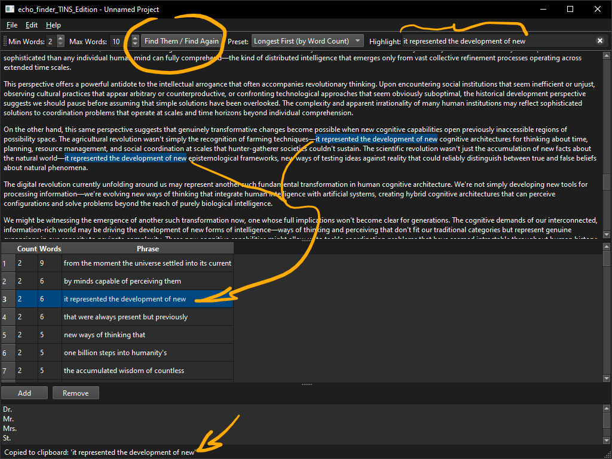

# echo_finder

A smart tool for writers to find and eliminate repetitive phrases (echoes) in their text.



https://github.com/user-attachments/assets/a8edbe24-b0ee-4799-8381-96c4851cb8a1

## About The Project

`echo_finder_TINS_Edition` is a desktop application designed specifically for writers, editors, and content creators who want to improve the quality and flow of their narrative. It goes beyond simple word counting to intelligently identify and highlight redundant phrases, helping you create fresher, more engaging text.

The core of `echo_finder_TINS_Edition` is its "Maximal Match" logic. Instead of overwhelming you with every minor repetition, it focuses on the **longest possible repeating sequences**, giving you the most significant and actionable insights to refine your work.

### Key Features

-   **Maximal Match Logic**: Intelligently finds the longest repeating phrases ("greedy" matching) and hides shorter, overlapping echoes to reduce noise.
-   **Live Interactive Highlighting**: Click a result to see all its occurrences instantly highlighted. Edit your text and watch the highlights update in real-time, just like in a modern code editor. The live count in the results list shows your progress as you eliminate echoes.
-   **Customizable Appearance & Themes**: Tailor the look and feel of the application. Choose between Light, Dark, or Auto (system) themes, and select from available UI styles like Fusion or Windows. Your preferences are saved for your next session.
-   **Persistent Sorting Presets**: Organize results by frequency or word count. Your preference is saved and remembered for your next session.
-   **Configurable Word Count**: Set a minimum and maximum number of words for a phrase to be considered an echo, giving you full control over the analysis.
-   **Custom Whitelist**: Preserve the integrity of abbreviations and proper nouns (e.g., "Dr.", "Mr. Jones") by adding them to a project-specific whitelist.
-   **Seamless Clipboard Integration**: By default, clicking a found phrase instantly copies it to your clipboard, enabling a rapid workflow with your favorite external text editor.
-   **Project Management**: Save your text, configurations, and results into a simple `.json` file to resume your work at any time.

### Built With

`echo_finder_TINS_Edition` is built with modern, robust technologies to ensure performance and a clean user experience.

*   [**PySide6**](https://www.qt.io/qt-for-python): The official Python bindings for the Qt framework, used for building the entire graphical user interface.
*   **Regular Expression Tokenizer**: The core text processing engine is built using Python's native `re` module. This powerful approach allows for precise and flexible tokenization, ignoring punctuation while respecting a custom whitelist, which is crucial for accurate echo detection across sentence boundaries.

## Getting Started

Follow these steps to get `echo_finder_TINS_Edition` running on your local machine.

### Prerequisites

-   Python 3.8+

### Installation

1.  **Clone the repository:**
    ```sh
    git clone https://github.com/fernicar/echo_finder_TINS_Edition.git
    ```
2.  **Navigate to the project directory:**
    ```sh
    cd echo_finder_TINS_Edition
    ```
3.  **Create and activate a virtual environment (recommended):**
    -   On Windows:
        ```sh
        python -m venv .venv
        .\venv\Scripts\activate
        ```
    -   On macOS/Linux:
        ```sh
        python3 -m venv .venv
        source .venv/bin/activate
        ```
4.  **Install the required dependencies:**
    ```sh
    pip install -r requirements.txt
    ```
5.  **Run the application:**
    ```sh
    python main.py
    ```

## Usage

1.  **Input Text**: Paste your text directly into the top panel, or open a previously saved `.json` project file via `File > Open`.
2.  **Configure Parameters**: Use the toolbar to set the `Min Words` and `Max Words` for the phrase search.
3.  **Find Echoes**: Click the `Find Them / Find Again` button to start the analysis. The UI will remain responsive while the processing happens in the background.
4.  **Review and Curate**: Once you have a list of echoes, you can begin curating your text using one of two primary workflows:

    *   **Workflow 1: In-App Curation**
        Click any phrase in the results list. All instances of that phrase will be highlighted in the text editor above. The phrase also appears in the "Highlight" toolbar field. You can now edit the main text, and the highlights and the "Count" in the results list will update live, showing you your progress as you eliminate echoes.

    *   **Workflow 2: Curation in Your Favorite Editor**
        By default, "Auto Copy" is enabled (`Edit > Auto Copy...`). Simply click any phrase in the results list to copy it to your clipboard. Switch to your preferred text editor (like VS Code, Sublime Text, etc.), press `Ctrl+F` to open the find dialog, and `Ctrl+V` to paste the phrase. You can then use your editor's powerful search and replace tools to curate the echoes.

5.  **Customize the UI**: Go to `Edit > Appearance` or `Edit > Theme` to change the application's look and feel. Your choices are saved automatically and will be used the next time you launch the app.
6.  **Save Your Work**: Use `File > Save` or `Save As` to store your session in a `.json` file.

## License
[MIT License](LICENSE)

---

## Acknowledgments
*   Special thanks to ScuffedEpoch for the TINS methodology and the initial example.
*   Thanks to the free tier AI assistant for its initial contribution to the project.
*   Research LLM Gemini2.5flash (free tier beta testing) from Google AI Studio.

This project builds upon the foundations of the following projects:
- [TINS Edition](https://ThereIsNoSource.com) - Zero Source Specification platform that enables:
  - Complete application reconstruction from specification
  - Self-documenting architecture through detailed markdown
  - Future-proof design adaptable to advancing LLM capabilities
  - Progressive enhancement support as LLM technology evolves
  - Platform-agnostic implementation guidelines
  - Flexible technology stack selection within specified constraints
  - Comprehensive behavioral specifications for consistent rebuilds
  - Automatic adaptation to newer LLM models and capabilities
- [JeredBlu's PRD Creator](https://github.com/JeredBlu/custom-instructions/blob/main/prd-creator-3-25.md) - A comprehensive Product Requirements Document (PRD) creator.