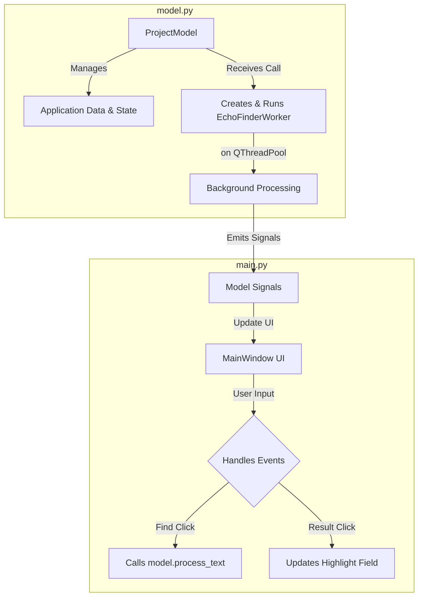

# TINS Echo Finder

## Description

A powerful desktop utility built with Python and PySide6, designed for writers, editors, and developers to analyze text and identify repeated phrases, commonly known as "echoes." The application helps users improve the quality of their prose by highlighting repetitive language. Users can paste text, define the phrase length to search for, and receive a comprehensive, sortable list of all echoed phrases. The entire project, including text, settings, and results, can be saved and loaded for later review.

## Functionality

### Core Features

-   **Text Analysis:** Paste or open large blocks of text for analysis in the main editor.
-   **Configurable Phrase Search:** Define the minimum and maximum number of words a phrase must contain to be considered an echo using dedicated spinbox controls.
-   **Responsive Echo Detection:** A background process scans the text to find all phrases that repeat two or more times, ensuring the UI remains responsive and does not freeze during analysis.
-   **Maximal Match Filtering:** The core algorithm intelligently filters out sub-phrases. For example, if "the quick brown fox" is an echo, the tool will not separately report "the quick brown" or "quick brown fox".
-   **Results Display:** View all found echoes in a clear, sortable table showing the repetition count, word count, and the phrase itself.
-   **Live Highlighting:** Select an echo from the results list or type a phrase to see all its occurrences instantly highlighted in the main text editor.
-   **Whitelist Management:** Maintain a custom list of words or abbreviations (e.g., "Mr.", "Dr.", "i.e.") to be treated as single, case-sensitive units during analysis, preventing them from being broken up or lowercased.
-   **Project Persistence:** Save and load entire analysis sessions as human-readable `.json` files. This includes the original text, all settings, the whitelist, and the discovered echoes.
-   **UI Customization:** Switch between Light, Dark, and System default themes. Apply various native UI styles (e.g., Fusion, Windows, etc.) for a personalized look and feel.
-   **Dirty State Indicator:** A red border appears around the text input area when the text or analysis parameters have changed, visually indicating that the current results are stale and a new analysis should be run.
-   **Clipboard Integration:** Automatically copy a phrase to the system clipboard when it is selected from the results table (this feature can be toggled).

### User Interface

The application's main window is organized into a clean, three-part vertical layout using a splitter, with a comprehensive toolbar for primary actions and a standard menu bar.

```
+---------------------------------------------------------------------------------------------------+
| [File] [Edit] [Help]                                                                              |
+---------------------------------------------------------------------------------------------------+
| Min Words: [2] Max Words: [8] [ Find Them / Find Again ] Preset: [Longest First ▼] Highlight: [ ] |
+---------------------------------------------------------------------------------------------------+
|                                                                                                   |
|   +-------------------------------------------------------------------------------------------+   |
|   |                                                                                           |   |
|   | Narrative Text Editor (Paste your source text here...)                                    |   |
|   |                                                                                           |   |
|   +-------------------------------------------------------------------------------------------+   |
|                                                                                                   |
|   +-------------------------------------------------------------------------------------------+   |
|   | | Count ▼ | Words   | Phrase                                                              |   |
|   | |---------|---------|---------------------------------------------------------------------|   |
|   | | 3       | 5       | the quick brown fox jumps                                           |   |
|   | | 2       | 4       | over the lazy dog                                                   |   |
|   +-------------------------------------------------------------------------------------------+   |
|                                                                                                   |
|   +-------------------------------------------------------------------------------------------+   |
|   | [ Add ] [ Remove ]                                                                        |   |
|   | +---------------------------------------------------------------------------------------+ |   |
|   | | Whitelist:                                                                            | |   |
|   | | - Dr.                                                                                 | |   |
|   | | - Mr.                                                                                 | |   |
|   | | - i.e.                                                                                | |   |
|   | +---------------------------------------------------------------------------------------+ |   |
|   +-------------------------------------------------------------------------------------------+   |
+---------------------------------------------------------------------------------------------------+
| Status: Processing complete. Found 2 maximal echoes.                                              |
+---------------------------------------------------------------------------------------------------+
```

### Behavior Specifications

-   **Analysis Workflow:**
    1.  The user pastes text into the top `QTextEdit` panel.
    2.  The user adjusts the `Min Words` and `Max Words` `QSpinBox` controls in the toolbar. The spinboxes are linked, preventing the minimum from exceeding the maximum.
    3.  The user clicks the `"Find Them / Find Again"` button. The button is disabled if the text contains fewer words than the specified minimum.
    4.  The analysis runs in a background thread. The status bar at the bottom provides feedback on the process.
    5.  Upon completion, the middle `QTableWidget` populates with the results.
-   **Result Interaction:**
    1.  Clicking any cell in a row in the results table populates the `"Highlight"` `QLineEdit` in the toolbar with that row's phrase.
    2.  If the `"Auto Copy Phrase to Clipboard"` option in the `Edit` menu is checked, the phrase is also copied to the system clipboard, and a confirmation appears in the status bar.
-   **Sorting:** The results table can be sorted using the `"Preset"` `QComboBox` with two options:
    1.  `longest_first_by_word_count`: Sorts results primarily by word count (descending), secondarily by repetition count (descending), and finally alphabetically by phrase.
    2.  `most_repeated_short_to_long`: Sorts results primarily by repetition count (descending), secondarily by word count (ascending), and finally alphabetically by phrase.
-   **Live Highlighting Dynamics:**
    1.  When text is entered into the `"Highlight"` field, a debounced timer (250ms) triggers the highlighting function to ensure performance.
    2.  All exact, case-insensitive matches for the text are highlighted in the main narrative editor.
    3.  Simultaneously, the `"Count"` column for the corresponding phrase in the results table is updated in real-time to reflect the number of highlighted instances. If the count drops below 2, the number is grayed out.
-   **Saving and Loading:** Standard `File` menu options (`New`, `Open`, `Save`, `Save As`) allow users to manage projects. Saving captures the entire application state into a `.json` file.
-   **Whitelist Management:** The bottom panel contains a `QListWidget` for the whitelist. The `Add` button opens a dialog to enter a new term, and the `Remove` button deletes the selected term(s).

## Technical Implementation

### Architecture

The application follows a Model-View architecture, leveraging Qt's signals and slots mechanism for communication. This separation ensures the UI remains responsive while data processing occurs in the background.



-   **Model (`model.py`):** The `ProjectModel` class acts as the single source of truth. It encapsulates all application data (text, settings, results) in a dictionary. It handles file I/O for project files and is responsible for creating and dispatching the analysis worker to a `QThreadPool`.
-   **View/Controller (`main.py`):** The `MainWindow` class constructs and manages all UI widgets. It handles user input events (clicks, text changes), sending requests to the model or updating its state directly. It connects to signals emitted by the model (e.g., `echo_results_updated`) to update the UI components accordingly.
-   **Concurrency:** The computationally intensive echo-finding process is encapsulated in the `EchoFinderWorker` class, which inherits from `QRunnable`. This worker is executed in a background thread from a global `QThreadPool`, preventing the UI from freezing during analysis. It communicates results, status updates, and errors back to the main thread via a `WorkerSignals` object.

### Data Model (Project JSON Structure)

Project files are stored in a human-readable JSON format, capturing the complete state of an analysis session.

```json
{
  "project_name": "string",
  "original_text": "string",
  "min_phrase_words": "integer",
  "max_phrase_words": "integer",
  "custom_whitelist": ["string"],
  "last_used_sort_preset": "string ('longest_first_by_word_count' or 'most_repeated_short_to_long')",
  "echo_results": [
    {
      "phrase": "string",
      "count": "integer",
      "words": "integer",
      "occurrences": [
        {"start": "integer", "end": "integer"}
      ]
    }
  ]
}
```

### Core Algorithm (Echo Finding)

The echo finding logic resides in the `EchoFinderWorker` class and follows these steps:
1.  **Tokenization:** The input text is pre-processed into a list of word tokens. A regular expression is constructed that combines the custom whitelist with a general word pattern (`\b[a-zA-Z0-9'-]+\b`). `re.finditer` is used to find all matches. Each token stores the word itself and its start/end character indices from the original text. Whitelisted words are preserved case-sensitively; all other words are lowercased.
2.  **N-gram Generation:** The system iterates through the token list using a sliding window approach, generating all possible phrases (n-grams) for every length `n` from `min_phrase_words` to `max_phrase_words`. A `defaultdict(list)` maps each unique phrase string to a list of its occurrence locations (start/end character indices).
3.  **Frequency Filtering:** The resulting dictionary of phrases is filtered, keeping only items that have occurred two or more times.
4.  **Maximal Match Filtering:** To provide the most useful results, sub-phrases are filtered out.
    -   First, the list of echo phrases is sorted by the number of words in each phrase, in descending order.
    -   The algorithm then iterates through this sorted list. For each `phrase`, it checks if it is a substring of any longer phrase that has *already been accepted* into the final `maximal_echoes` dictionary.
    -   If it is a substring, it is discarded. Otherwise, it is added to the final results. This ensures only the longest, "maximal" repeated phrases are reported.

### Dependencies

The application relies on a single external library:
-   `PySide6` for the graphical user interface.

### Persistence

-   **Project Data:** The entire session state (text, settings, results) is saved and loaded by the user via the `File` menu into `.json` files.
-   **UI Settings:** Application-level settings like window size and position, current theme, and UI style are automatically saved on exit and restored on launch using `QSettings` under the organization name "fernicar" and application name "echo_finder_TINS_Edition".